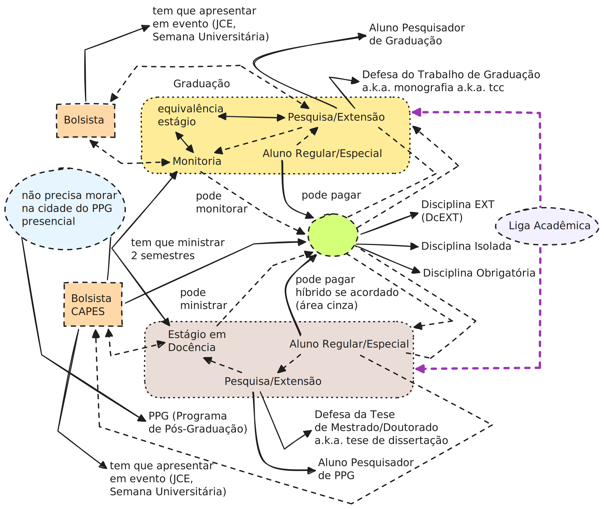

### adcme (WIP)

> adcme: Autonomia Didático-Científica para o Movimento Estudantil. Working Draft, Work-in-progress.

Este repositório visa servir como uma cheatsheet pessoal rápida para a construção de politização e cidadania junto ao movimento estudantil na UPE (Universidade de Pernambuco).

O objetivo central é aumentar o nível de autonomia didático-científica pro movimento estudantil (Artigo 207 da Constituição de 1988 [2]) nas universidades públicas (e criar representatividade em áreas sub-representadas em Computação, como cybersec/infosec), Ciência Aberta, Arquivística, e pesquisa independente, para que os estudantes consigam colaborar com os professores e ter uma maior diversidade de áreas de capacitação.

Adicionalmente, vários desses links também servem como técnicas e referências para Defesa de Tese, no sentido literal da frase, e não o ritual acadêmico de Mestrado e Doutorado.

- [1] [Guia de Ciência Aberta (Open Science) da USP 2026](https://cienciaaberta.usp.br/wp-content/uploads/sites/978/2026/02/Guia-para-Cienencia-Aberta-fechado.pdf)
- [2] [Indissociabilidade dos Pilares de Ensino, Pesquisa e Extensão nas universidades, e autonomia didático-científica](https://www.jusbrasil.com.br/topicos/10650167/artigo-207-da-constituicao-federal-de-1988)
- [3] [Cartilha IFPR pro movimento estudantil](https://ifpr.edu.br/irati/wp-content/uploads/sites/14/2018/12/CARTILHA-DE-REPRESENTACAO-ESTUDANTIL.pdf)
- [4] [Código de Ética da ACM (Association for Computing Machinery)](https://www.acm.org/code-of-ethics)
- [5] [Filosofias OSS, FLOSS e FOSS](https://www.gnu.org/philosophy/floss-and-foss.html)
- [6] [Movimento de Direito ao Reparo (Right to Repair)](https://en.wikipedia.org/wiki/Right_to_repair)
  - [7] [Keep Android Open](https://keepandroidopen.org/pt-BR/)

Arquivística:

de artigos com Sci-hub e Anna's Archive, e de páginas web com a Wayback Machine:
- [8] [sci-hub, the evil website](https://sci-hub.ru/)
- [9] [annas-archive](https://annas-archive.gd/)
- [10] [Wayback Machine](https://web.archive.org/)

Templates LaTeX:
- [11] [template SBC (Sociedade Brasileira de Computação)](https://www.overleaf.com/latex/templates/sbc-conferences-template/blbxwjwzdngr)
- [12] [template ACM (Association for Computing Machinery)](https://www.acm.org/publications/proceedings-template)

Organização das Referências pro trabalho (.bib, etc)
- [13] [mendeley](https://www.mendeley.com/reference-manager/library/)
- [14] [zotero](https://www.zotero.org/)

Pesquisa anônima e/ou atuando com pseudônimos:
- [15] [Registro ORCID](https://orcid.org/)

Repositórios de Artefatos:
- [16] [Anonymous Github](https://anonymous.4open.science/)
- [17] [Zenodo](https://zenodo.org/)
- [18] [Figshare](https://figshare.com/)
- [19] [OSF: Open Science Foundation](https://osf.io/)
- [20] [HAL (Hyper Articles en Ligne)](https://hal.science/)

Plataformas de publicações independentes:
- [21] [Arxiv](https://arxiv.org/)
- [22] [MDPI](https://www.mdpi.com/openaccess)
- [23] [Springer Open](https://www.springeropen.com/)

Guia pra Avaliação de Trabalhos Empíricos em Engenharia de Software da ACM
- [24] [SIGPLAN: Empirical Evaluation Guidelines](https://www.sigplan.org/Resources/EmpiricalEvaluation/)

Anti-paywall:
- [25] [sci-hub, the evil website](https://sci-hub.ru/)
- [26] [12-feet-ladder](https://12ft.io/)
- [27] [Freedium](https://freedium.cfd/)

### Documentação para Ligas Acadêmicas

Os documentos abaixos discutem autonomia didático-científica pro movimento estudantil via o sistema das Ligas Acadêmicas na UPE:
- [28] [Art. 207 da constituição de 1988](https://www.jusbrasil.com.br/topicos/10650167/artigo-207-da-constituicao-federal-de-1988)

Mecânicas de Liga Acadêmica, extensão e eventos:
- [29] [Ligas Acadêmicas na UPE](https://www.upe.br/ligas-academicas.html)
- [30] [Extensão na UPE](https://upe.br/extensao/)
- [31] [Formulário de Cadastro de Liga Acadêmica](https://forms.gle/EgGGVfCzJY7v4ecB9)
- [32] [Resolução CEPE Nº 092/2019](https://drive.google.com/file/d/1Mrkyv6A9o8u-Hq0CtvidMvP-aBSkaGL_/view):
- [33] [RESOLUÇÃO CONSUN No 056/2025: Emissão de certificados para eventos](https://web.archive.org/web/20260306220817/https://drive.google.com/file/d/1NMa8oouQs-sf7qFDMYlEt3BorXMOFk_P/view):
- [34] [Guia da Creditação das Atividades de Extensão](https://drive.google.com/file/d/1H8Qggrm9lfcS2dlMWKzFAnUCdPTaOazP/view)

Ponte com o PPGEC (Programa de Pós-Graduação em Engenharia da Computação) da UPE:
- [35] [Manual de Orientações PROAP](https://antigo.upe.br/normas-e-documentos-pos-graduacao.html?download=642:manual-de-orienta%C3%A7%C3%A3o-para-o-uso-do-proap)
- [36] [Política de Internacionalização da UPE](https://www.upe.br/anexos/documentos_institucionais/Politica_de_Internacionalizacao_da_UPE_15_06_17.pdf)
- [37] [Missão, visão e valores PPGEC](https://w2.solucaoatrio.net.br/somos/upe-ppgec/index.php/pt/apresentacao). Keywords: "colaboração interinstitucionais", interinstitucional.
