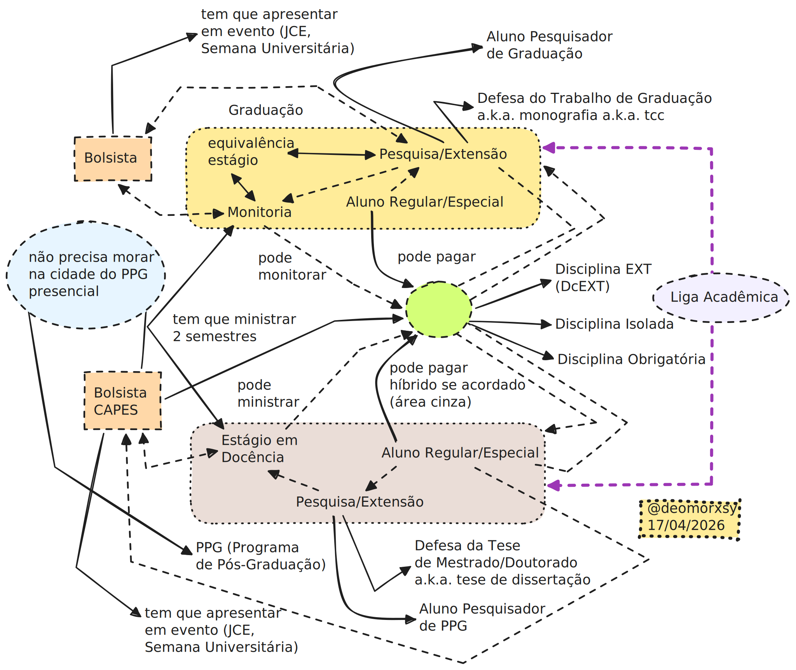
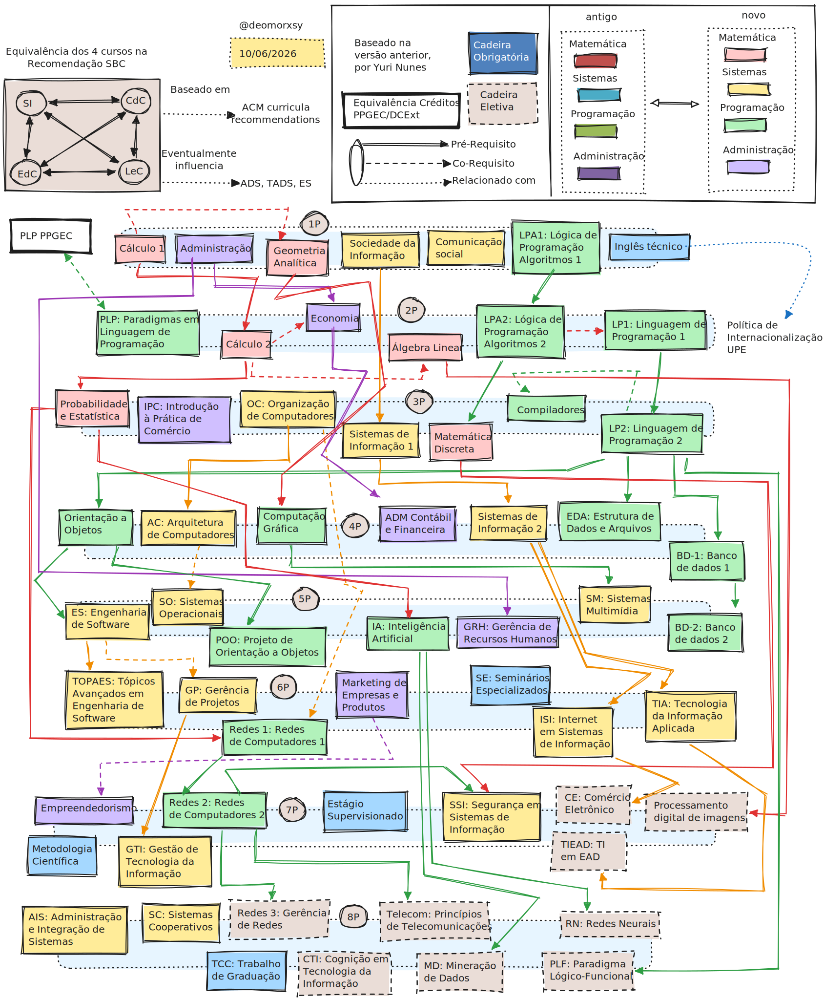

### adcme (WIP)

> [adcme](https://github.com/deomorxsy/adcme): Autonomia Didático-Científica para o Movimento Estudantil [2]. Working Draft, Work-in-progress (WIP).

### 0. Abstract

Este repositório visa servir como uma cheatsheet pessoal rápida e Carta Aberta para a construção de politização e cidadania junto ao movimento estudantil na UPE (Universidade de Pernambuco).

O objetivo central é aumentar o nível de autonomia didático-científica pro movimento estudantil (Artigo 207 da Constituição de 1988 [2]) nas universidades públicas (e criar representatividade em áreas sub-representadas em Computação, como cybersec/infosec), Ciência Aberta, Arquivística, e pesquisa independente, para que os estudantes consigam colaborar com os professores e ter uma maior diversidade de áreas de capacitação.

Adicionalmente, vários desses links também servem como técnicas e referências para Defesa de Tese, no sentido literal da frase, não necessariamente o ritual acadêmico de Mestrado e Doutorado.




- [0] [Dossiê Florestan Fernandes Revisado: Estudo preliminar sobre condição do Pós-graduando brasileiro no mundo do trabalho e da formação](https://drive.google.com/file/d/16-fp0SJ-uACyVRrIfCHIG5uqpb7auEeh/view). São Paulo: ANPG/CEMJ, 2023. Keywords: "Pesquisa é trabalho, mas bolsa não é salário"
- [1] [Guia de Ciência Aberta (Open Science) da USP 2026](https://cienciaaberta.usp.br/wp-content/uploads/sites/978/2026/02/Guia-para-Cienencia-Aberta-fechado.pdf)
- [2] [Art. 207 da constituição de 1988](https://www.jusbrasil.com.br/topicos/10650167/artigo-207-da-constituicao-federal-de-1988): Indissociabilidade dos Pilares de Ensino, Pesquisa e Extensão nas universidades, e autonomia didático-científica.
- [3] [Cartilha IFPR pro movimento estudantil](https://ifpr.edu.br/irati/wp-content/uploads/sites/14/2018/12/CARTILHA-DE-REPRESENTACAO-ESTUDANTIL.pdf)
- [4] [Código de Ética da ACM (Association for Computing Machinery)](https://www.acm.org/code-of-ethics)
- [5] [Filosofias OSS, FLOSS e FOSS](https://www.gnu.org/philosophy/floss-and-foss.html)
- [6] [Movimento de Direito ao Reparo (Right to Repair)](https://en.wikipedia.org/wiki/Right_to_repair)
  - [7] [Keep Android Open](https://keepandroidopen.org/pt-BR/)

Arquivística:

de artigos com Sci-hub e Anna's Archive, e de páginas web com a Wayback Machine:
- [8] [sci-hub, the evil website](https://sci-hub.ru/)
- [9] [annas-archive](https://annas-archive.gd/)
- [10] [Wayback Machine](https://web.archive.org/)

Templates LaTeX:
- [11] [template SBC (Sociedade Brasileira de Computação)](https://www.overleaf.com/latex/templates/sbc-conferences-template/blbxwjwzdngr)
- [12] [template ACM (Association for Computing Machinery)](https://www.acm.org/publications/proceedings-template)

Organização das Referências pro trabalho (.bib, etc)
- [13] [mendeley](https://www.mendeley.com/reference-manager/library/)
- [14] [zotero](https://www.zotero.org/)


Pesquisa anônima e/ou atuando com pseudônimos:
- [15] [Registro ORCID](https://orcid.org/)

Repositórios de Artefatos:
- [16] [Anonymous Github](https://anonymous.4open.science/)
- [17] [Zenodo](https://zenodo.org/)
- [18] [Figshare](https://figshare.com/)
- [19] [OSF: Open Science Foundation](https://osf.io/)
- [20] [HAL (Hyper Articles en Ligne)](https://hal.science/)

Plataformas de publicações independentes:
- [21] [Arxiv](https://arxiv.org/)
- [22] [MDPI](https://www.mdpi.com/openaccess)
- [23] [Springer Open](https://www.springeropen.com/)

Guia pra Avaliação de Trabalhos Empíricos em Engenharia de Software da ACM
- [24] [SIGPLAN: Empirical Evaluation Guidelines](https://www.sigplan.org/Resources/EmpiricalEvaluation/)

Anti-paywall:
- [25] [sci-hub, the evil website](https://sci-hub.ru/)
- [26] [12-feet-ladder](https://12ft.io/)
- [27] [Freedium](https://freedium.cfd/)

### 1. Documentação para Ligas Acadêmicas

Os documentos abaixos discutem autonomia didático-científica pro movimento estudantil via o sistema das Ligas Acadêmicas na UPE:

Mecânicas de Liga Acadêmica, extensão e eventos:
- [28] [Ligas Acadêmicas na UPE](https://www.upe.br/ligas-academicas.html)
- [29] [Extensão na UPE](https://upe.br/extensao/)
- [30] [Formulário de Cadastro de Liga Acadêmica](https://forms.gle/EgGGVfCzJY7v4ecB9)
- [31] [Resolução CEPE Nº 092/2019](https://drive.google.com/file/d/1Mrkyv6A9o8u-Hq0CtvidMvP-aBSkaGL_/view). Regulamenta a formação e o funcionamento das Ligas Acadêmicas, no âmbito da UPE.
- [32] [RESOLUÇÃO CONSUN No 056/2025: Emissão de certificados para eventos](https://web.archive.org/web/20260306220817/https://drive.google.com/file/d/1NMa8oouQs-sf7qFDMYlEt3BorXMOFk_P/view):
- [33] [Guia da Creditação das Atividades de Extensão](https://drive.google.com/file/d/1H8Qggrm9lfcS2dlMWKzFAnUCdPTaOazP/view)

Ponte com o PPGEC (Programa de Pós-Graduação em Engenharia da Computação) da UPE:
- [34] [Manual de Orientações PROAP](https://antigo.upe.br/normas-e-documentos-pos-graduacao.html?download=642:manual-de-orienta%C3%A7%C3%A3o-para-o-uso-do-proap)
- [35] [Política de Internacionalização da UPE](https://www.upe.br/anexos/documentos_institucionais/Politica_de_Internacionalizacao_da_UPE_15_06_17.pdf)
- [36] [Missão, visão e valores PPGEC](https://w2.solucaoatrio.net.br/somos/upe-ppgec/index.php/pt/apresentacao). Keywords: "colaboração interinstitucionais", interinstitucional.

### 2. Monitoria de Graduação e Estágio-Docência em Pós-Graduação:

- [37] Leta, F. R.; Mello, M. H. C. S.; Barbejat, M. E. R. P. [Estágio em docência: monitoria em nível de pós-graduação](https://admin.abenge.org.br/cobenge/legado/arquivos/18/trabalhos/APP003.pdf). In: COBENGE, 19., 2001, Porto Alegre. Anais eletrônicos [...]. Porto Alegre: PUCRS, 2001. Disponível em: http://www.abenge.org.br/cobenge/arquivos/18/trabalhos/APP003.pdf. Acesso em: 28 nov. 2018.
- [46] [Estágio de docência: caminhos formativos para a educação superior na perspectiva de estudantes de pós-graduação](http://educa.fcc.org.br/scielo.php?script=sci_arttext&pid=S1519-39932022000100102)
- [47] UNIVERSIDADE ESTADUAL DO CEARÁ. MARIA MÁRCIA MELO DE CASTRO MARTINS. [ESTÁGIO DE DOCÊNCIA NA PÓS-GRADUAÇÃO STRICTO SENSU: UMA PERSPECTIVA DE FORMAÇÃO PEDAGÓGICA](https://www.uece.br/ppge/wp-content/uploads/sites/29/2019/06/Disserta%C3%A7%C3%A3o_MARIA-M%C3%81RCIA-MELO-DE-CASTRO-MARTINS.pdf). FORTALEZA – CEARÁ. 2013.


### 3. Processos híbridos de ensino no PPGEC da UPE (Multicampi)

- [38] [Instrução Normativa nº 2/2024 da Capes](https://cad.capes.gov.br/ato-administrativo-detalhar?idAtoAdmElastic=16843#anchor): Estabelece diretrizes gerais para a implementação de processos híbridos de ensino e aprendizagem na Pós-Graduação stricto sensu presencial.
- [39] [Bolsista da CAPES não precisa residir onde faz o curso](https://www.gov.br/capes/pt-br/assuntos/noticias/bolsista-da-capes-nao-precisa-residir-onde-faz-o-curso)
- [40] [Portaria nº 79/2023](https://cad.capes.gov.br/ato-administrativo-detalhar?idAtoAdmElastic=11663#anchor). X – fixar residência na cidade onde realiza o curso; (Revogado pela Portaria nº 79, de 28 de Abril de 2023)
- [41] [1.9 Visão da área sobre Processos Híbridos de Ensino e Aprendizagem (PHEA) em PPG](https://www.gov.br/capes/pt-br/acesso-a-informacao/acoes-e-programas/avaliacao/sobre-a-avaliacao/areas-avaliacao/sobre-as-areas-de-avaliacao/colegio-de-ciencias-exatas-tecnologicas-e-multidisciplinar/ciencias-exatas-e-da-terra/COMPUTACAO_DOCAREA_2025_2028.pdf). Página 19.
- [55] [Portaria nº 133, de 10 de Julho de 2023](https://cad.capes.gov.br/ato-administrativo-detalhar?idAtoAdmElastic=12302#anchor). Regulamenta o acúmulo de bolsas de mestrado, doutorado e pós-doutorado concedidas pela CAPES no País com atividade remunerada ou outros rendimentos.
- [56] [Portaria nº 187, de 28 de Setembro de 2023](https://cad.capes.gov.br/ato-administrativo-detalhar?idAtoAdmElastic=13124#anchor). Altera a Portaria nº 133, de 10 de julho de 2023.


Entre 2024 e 2025, o PPGEC teve 207 estudantes matriculados, com mais de 100 pessoas a mais do que o segundo PPG no ranking de "quantidades de estudantes/PPG" da UPE [42].
- [42] [Fonte: Edital de Apoio à Pesquisa (APQ) UPE  – 2025](https://drive.google.com/file/d/1EW804UC8weTCN5cgPmYAxmhYqxOuHjCQ/view)


### 4. Equivalências de estágio e trabalho remoto (teletrabalho)

"§ 3º Na educação superior, as atividades de extensão, de monitorias, de iniciação científica e de intercâmbio no exterior desenvolvidas pelo estudante poderão ser equiparadas ao estágio em caso de previsão no projeto pedagógico do curso." (NR) [43].
- [43] [LEI Nº 11.788, DE  25 DE SETEMBRO DE 2008. Dispõe do Estágio de Estudantes](https://www.planalto.gov.br/ccivil_03/_ato2007-2010/2008/lei/l11788.htm).

"§ 6º Fica permitida a adoção do regime de teletrabalho ou trabalho remoto para estagiários e aprendizes. (Incluído pela Lei nº 14.442, de 2022)" [44] [45].
- [44] [DECRETO-LEI Nº 5.452, DE 1º DE MAIO DE 1943](https://www.planalto.gov.br/ccivil_03/decreto-lei/del5452.htm#art75b.1): Consolidação das leis de trabalho.
- [45] [LEI Nº 14.442, DE 2 DE SETEMBRO DE 2022](https://www.planalto.gov.br/ccivil_03/_ato2019-2022/2022/lei/l14442.htm#art6):  Dispõe sobre o pagamento de auxílio-alimentação ao empregado e altera a Lei nº 6.321, de 14 de abril de 1976, e a Consolidação das Leis do Trabalho, aprovada pelo Decreto-Lei nº 5.452, de 1º de maio de 1943.


### 5. Movimento Estudantil e Socio-Technical aspects in Information Systems

Literatura de Design Science Research, repositório da @margaretstorey:
- [48] [Week 5: Literature Reviews on Software Engineering Research](https://github.com/margaretstorey/EmseUvic2020/blob/master/resources/literature.md)

A relação com o movimento estudantil pode ser explorado pelo termo "socio-technical" usado aí como keyword:
- [49] [Socio-technical IS design science research: developing design theory for IS integration management](https://link.springer.com/article/10.1007/s10257-010-0140-6)
- [50] [Instituting socio-technical education futures: encounters with/through technical democracy, data justice, and imaginaries](https://www.tandfonline.com/doi/epdf/10.1080/17439884.2023.2205225?needAccess=true)
- [51] [Information literacy practices and student protests: mapping community information landscapes](https://informationr.net/ir/18-3/colis/paperC39.html)
- [52] [Student Protests. Three Periods of University Governance](https://www.triple-c.at/index.php/tripleC/article/download/771/1005)
- [53] [Strengthening of the Sociotechnical Approach in Information Systems Research](https://books-sol.sbc.org.br/index.php/sbc/catalog/download/28/110/260-1?inline=1)

Resistência Estudantil:
- [54] Germek, O. A. (1941). [A Liga de Combate a Sífilis: sua ação em vinte anos de atividade](https://revistas.usp.br/revistadc/en/article/view/50524). Revista De Medicina, 25(87), 9-14. https://doi.org/10.11606/issn.1679-9836.v25i87p9-14 . Mirror em: https://revistas.usp.br/revistadc/article/download/50524/54640/0


- [57] [Currículo de referência SBC](https://www.sbc.org.br/wp-content/uploads/2024/07/Curriculo-de-Referencia-IS-versao-2003.pdf)


---

Quanto ao comparecimento à eventos de Computação, tem algumas formas de tornar possível:
- 1: trazendo a premissa do evento pra cá, por meio de um evento estudantil: as regras de emissão de certificados pra eventos online/virtuais/remotos valem [32], Ligas Acadêmicas [31] ou de extensão [33] pra chamar egressos, ex-estudantes, o pessoal do PPGEC ou entusiastas/pesquisadores que queiram contribuir
- 2: entrando em contato com um pesquisador, geralmente um professor, que mora perto do lugar do evento. Pra formalizar essa pessoa pode entrar na Liga (se for estudante/professor em uma universidade, graduação ou PPG) ou no grupo de pesquisa (que é encabeçado por um professor)
- 3: usando da verba de transporte e diárias pra se deslocar até lá e apresentar: tem uma pros professores e outra pros alunos
  - essa tem no PPGEC via o PROAP, pra professores e alunos [34]
  - em graduação, pode ser usado o exemplo da UPE Petrolina [58]
- [31]
- [32]
- [33]
- [34]
- [58] [Edital 04/2025, UPE Campus Petrolina: Apoio à Participação em Eventos – Apoio a Discente](https://www.upe.br/petrolina/wp-content/uploads/2025/08/Edital-Apoio-Discente-Campus-Petrolina.pdf)
- [59] [ACM curricula recommendations](https://www.acm.org/education/curricula-recommendations)
- [60] [Comunidae Episciences](https://www.episciences.org/)


### 6. Um FAQ rápido:

- 1: "Mas e se  eu não quero fazer pesquisa?": sem problema, desde o início as cadeiras já misturam pesquisa, extensão e ensino. Esses são indissociáveis e as universidades públicas devem obedecer essa indissociabilidade [1]
- 2: "Isso não é avançado demais pra graduação?": sem problema, no guia de creditação da extensão já existe previsão pro nivelamento através de sub-grupos dentro da cadeira de extensão. Nesses sub-grupos pode ocorrer o nivelamento didático e pedagógico pra adequar a diferentes grupos (de discentes e pós-graduandos). [33]
- 3: "Vou usar pra que isso aí?": o grupo de pesquisa na linha de pesquisa, por trás da disciplina, é quem costuma ir atrás das oportunidades e trazer pra mostrar. Não tem regra, mas faz parte de divulgação científica
- 4: "Nunca ouvi falar nessa cadeira, pra que vou pagar?": tem mais ou menos 10 anos que a disciplina não é mais ofertada pela desvalorização de toda a comunidade em relação à áreas sub-representadas, justamente por não ter divulgação científica

mas a ideia é tirar o máximo da grade curricular, e a disciplina existe lá, a linha de pesquisa de infraestrutura também existe, então agora só resta os estudantes levarem a demanda ao colegiado

O Centro Acadêmico (C.A.) pode ajudar, mas é possível apresentar a alternativa diretamente aos professores ou ao colegiado.
Caso o professor não tenha experiência lecionando X disciplina, exemplo de Telecom, a abordagem de pesquisa vai ajudar, pois no Pilar da Pesquisa é mais importante a vontade e a curiosidade do que a experiência prévia, o que nesse sentido acaba abrindo possibilidades.

- 5: "E o que tem a ver com o Egresso? Ele não tem mais vínculo com a universidade": parte do pilar da Extensão é oferecer serviços como aulas e cursos como cortesia pra comunidade. SI é um curso regido pela recomendação da SBC entre 4 cursos de computação equivalentes [57], (via pesquisa e extensão); os egressos fazem parte da comunidade da UPE E da sociedade brasileira da computação, no sentido literal da palavra e não necessariamente associado SBC. Além disso o público-alvo de entrada do PPGEC na região do agreste de Caruaru, é o egresso de SI, o único curso de computação em universidade pública da cidade [0]
- 6: "Por que você não deixa isso pra PPG?": o sistema de Ligas Acadêmicas permeia graduação e pós-graduação: vc pode criar a Liga no PPGEC, e estudantes de SI entrarem. E você pode criar em SI e estudantes do PPGEC entrarem. Professores podem entrar também. Pessoas de outras IES podem entrar também. Cursos relacionados com computação também podem entrar. E os eventos/workshops/etc podem ser remotos [31,32]
- 7: "Remoto? Mas a graduação e o PPG não são presenciais?": Existe esse sistema híbrido de ensino pros PPGs no Brasil [38, 40]; o PPGEC é multicampi, e existe mecânica de evento remoto de extensão/pesquisa/ensino na UPE [32]
- 8: "Ué, mas se o professor não tiver experiência com isso, como ele vai lecionar?": Aí que tá. O Art. 207 da constituição de 1988 [2] introduz a terminologia "Autonomia Didático-Científica" pras Universidades. Parte da universidade é o colegiado, e parte do colegiado é o Centro Acadêmico que serve pra representar os estudantes. Além disso, estudantes individuais podem fazer parte do colegiado, é só pedir pra participar por padrão. Isso quer dizer que autonomia didático-científica vale pro Movimento Estudantil e cada estudante independente, desde que o interesse desse estudante represente parcela dos estudantes, ou área sub-representada do segmento do curso, que no caso é a grande área de pesquisa de Computação. Daí tem outros fatores, como:
  - 8.1: a abordagem pedagógica de sala de aula invertida [?] e
  - 8.2: os cinco níveis de magistério superior na universidade fazem parte de outra classe social diferente dos estudantes

Sobre o ponto 8.2: professores tem salário e estão sob a previdência e outros benefícios trabalhistas. Estudantes trabalham com pesquisa, mas a bolsa de auxílio não é salário e portanto os estudantes ficam sujeitos à vulnerabilidade socioeconômica, o que reflete na vida acadêmica e automaticamente produção científica da IES. Além disso, 90% da mão de obra de pesquisa no Brasil vem dos estudantes de pós-graduação, o que via sistemas de Liga Acadêmica e Extensão valem pros discentes de graduação com PIBITI/PIBIC/BIA-PFA e outros [0].), sofrem o risco de conflito de interesses e represália da reitoria por serem concursados da UPE.

O estudante tem o auxílio do Movimento Estudantil, que é um movimento político e serve pra reivindicar direitos e políticas de assistência estudantil. Quer dizer que via o Movimento Estudantil o estudante consegue atuar em colaboração com os professores orientadores e trazer pesquisa, extensão, capacitação e outras coisas, ajudando a construir a universidade.

- [2] [Art. 207 da constituição de 1988](https://www.jusbrasil.com.br/topicos/10650167/artigo-207-da-constituicao-federal-de-1988): Indissociabilidade dos Pilares de Ensino, Pesquisa e Extensão nas universidades, e autonomia didático-científica.
- [33] [Guia da Creditação das Atividades de Extensão](https://drive.google.com/file/d/1H8Qggrm9lfcS2dlMWKzFAnUCdPTaOazP/view)
- [57] [Currículo de referência SBC](https://www.sbc.org.br/wp-content/uploads/2024/07/Curriculo-de-Referencia-IS-versao-2003.pdf)
- [0] [Dossiê Florestan Fernandes Revisado: Estudo preliminar sobre condição do Pós-graduando brasileiro no mundo do trabalho e da formação](https://drive.google.com/file/d/16-fp0SJ-uACyVRrIfCHIG5uqpb7auEeh/view). São Paulo: ANPG/CEMJ, 2023. Keywords: "Pesquisa é trabalho, mas bolsa não é salário"
- [32] [RESOLUÇÃO CONSUN No 056/2025: Emissão de certificados para eventos](https://web.archive.org/web/20260306220817/https://drive.google.com/file/d/1NMa8oouQs-sf7qFDMYlEt3BorXMOFk_P/view):
- [38] [Instrução Normativa nº 2/2024 da Capes](https://cad.capes.gov.br/ato-administrativo-detalhar?idAtoAdmElastic=16843#anchor): Estabelece diretrizes gerais para a implementação de processos híbridos de ensino e aprendizagem na Pós-Graduação stricto sensu presencial.
- [40] [Portaria nº 79/2023](https://cad.capes.gov.br/ato-administrativo-detalhar?idAtoAdmElastic=11663#anchor). X – fixar residência na cidade onde realiza o curso; (Revogado pela Portaria nº 79, de 28 de Abril de 2023)
- [31] [Resolução CEPE Nº 092/2019](https://drive.google.com/file/d/1Mrkyv6A9o8u-Hq0CtvidMvP-aBSkaGL_/view). Regulamenta a formação e o funcionamento das Ligas Acadêmicas, no âmbito da UPE.


### 7. Preprint and others

Glossário e dicionário de siglas:
- FAPESP: Fundação de Amparo à Pesquisa do Estado de São Paulo
- OPAS: Organização Pan-Americana da Saúde
- OMS: Organização Mundial da Saúde
- OPAS/OMS: Organização Pan-Americana da Saúde / Organização Mundial da Saúde [61]
- BIREME/OPAS/OMS: Centro Latino-Americano e do Caribe de Informação em Ciências da Saúde [61]
- SciELO: Scientific Electronic Library Online, criado em 1998. Iniciativa coordenada pela FAPESP e o BIREME/OPAS/OMS. [61]
- SOL: SBC Open Lib. A preprint open server. [62]

Glossário de universidades:
- UFSCAR: Universidade Federal de São Carlos
- UFRGS: Universidade Federal do Rio Grande do Sul
- UTFPR: Universidade Tecnológica Federal do Paraná
  - RIUT: Repositório Institucional da Universidade Tecnológica Federal do Paraná (RIUT)
- UnB: Universidade de Brasília
- UFSC: Universidade Federal de Santa Catarina

Digital Identifiers, pen-names, pseudonyms, anonymization, etc:
- ORCID (Open Researcher and Contributor ID) é um identificador digital gratuito de pesquisadores.
- DOI (Digital Object Identifier) é um código de identificação de documentos digitais, como artigos, livros, imagens etc.
- DataCite é uma organização internacional sem fins lucrativos integrada à ORCID que auxilia na localização, identificação e citação de conjuntos de dados de pesquisa e ajuda a criar e gerir registros de metadados e DOIs.
- OpenCitations é uma iniciativa que promove a disponibilidade de dados de citações acadêmicas.

Sobre Preprint, DOI, h-index, etc:
- [1]
- [61] [FAQ SciELO](https://preprints.scielo.org/index.php/scielo/faq). keywords: "O que é um preprint?"
- [62] [SOL: SBC Open Lib - sobre o servidor](https://preprints-sol.sbc.org.br/sbc/about)
- [63] [Academia StackExchange: How can I add a DOI or link to my article on Google Scholar?](https://academia.stackexchange.com/questions/96328/how-can-i-add-a-doi-or-link-to-my-article-on-google-scholar)
- [64] [DSpace](https://dspace.org/)

Alguns exemplos de Portal de Periódicos baseados em DSpace:
- [65] [RI-UFSCAR](https://repositorio.ufscar.br/)
- [66] [Lume UFRGS](https://lume.ufrgs.br/)
- [67] [RIUT UTFPR](https://repositorio.utfpr.edu.br/)
- [68] [RIUnB, da UnB](https://repositorio.unb.br/)
- [69] [BDM, da UnB, mantido pela SiB-UnB](https://bdm.unb.br/)
- [69] [RI-UFSC](https://repositorio.ufsc.br/) (usando Manakin como frontend)

Matrícula Assistida na UPE
- [70] [Página sobre Matrícula Assistida da UPE Campus Garanhuns](https://www.upe.br/garanhuns/graduacao/cursos-presenciais/bacharelado-em-engenharia-de-software/matricula-assistida/)
- [71] [Resolução CEPE No 082/2016](https://drive.google.com/file/d/1HFm538_6LjBgYPZVQ7iAdjoNdHxifH0a/view). Regulamenta o tempo máximo para integralização curricular dos Cursos de Graduação da UPE.
- [72] [Resolução CEPE No 084/2016](https://drive.google.com/file/d/10kZU3pILMoLbav9whoybWbBolp63Emws/view). Regulamenta o regime de matrícula assistida para discentes da UPE.


#### [15/06/2026, 21:14]

Mecânicas de Estudante de Graduação cursando Disciplinas Isoladas
de PPG (Programas de Pós-Graduação) como Aluno GradPG, uma generalização do Aluno Externo/Especial
- [73] [Portaria nº 291, de 13 de Setembro de 2024](https://cad.capes.gov.br/ato-administrativo-detalhar?idAtoAdmElastic=16305#anchor): Dispõe sobre o Programa de Graduação Integrada à Pós-Graduação stricto sensu (GradPG) da Coordenação de Aperfeiçoamento de Pessoal de Nível Superior (CAPES).
- [74] [Portaria nº 32, de 17 de Fevereiro de 2025](https://cad.capes.gov.br/ato-administrativo-detalhar?idAtoAdmElastic=17404): Altera a Portaria CAPES nº 291, de 13 de setembro de 2024.

"[...] Outro motivo, a modalidade aluno GradPG é aberta pra todos os estudantes de graduação e faz divulgação pra que tu consiga mandar a pesquisa de graduação, como o TCC, mesmo que fora de PIBITI/PIBIC/BIA-PFA/Monitoria de DCExt, dentro do período de entrada do PPG, pra congressos feito a CBSoft, que publicam os artigos no SOL-SBC, que por ser Qualis-A2 cumpre o requisito de Qualis-A4 que precisa pra defender a dissertação de mestrado [...]":
- [75] [CBSOFT 2026](https://cbsoft.sbc.org.br/2026/)
- [76] [SOL: SBC Open Lib, website for Journal of the Brazilian Computer Society (JBCS)](https://journals-sol.sbc.org.br/index.php/jbcs/about)
- [77] [Regimento Interno PPGEC](https://w2.solucaoatrio.net.br/somos/upe-ppgec/index.php/pt/downloads/finish/5-regimento-resolucoes-e-normas/734-regimento-interno-2024). Recife, Pernambuco, 2024.
- [78] [Plataforma Sucupira](https://sucupira-legado.capes.gov.br/sucupira/public/consultas/coleta/veiculoPublicacaoQualis/listaConsultaGeralPeriodicos.jsf)
- [79] [Grade Horária PPGEC 2026/1](https://web.archive.org/web/20260616010258/https://w2.solucaoatrio.net.br/upe-ppgec/pub/CourseExecutionTimetable.do?method=courseExecutionTimetableByPeriod&lng=pt&pg_query=8555587539764454&pg_range=25)


### 8. Equivalência dos quatro cursos SBC, Árvore detalhada de SI





###  9. Improving TCC knowledge early on university

These are supported by [abnTeX2](https://www.abntex.net.br/). Its [documentation]() is also available at github.
- ABNT NBR 6022:2018: Informação e documentação - Artigo em publicação periódica científica impressa - Apresentação
- ABNT NBR 6023:2002: Informação e documentação - Referência - Elaboração
- ABNT NBR 6024:2012: Informação e documentação - Numeração progressiva das seções de um documento - Apresentação
- ABNT NBR 6027:2012: Informação e documentação - Sumário - Apresentação
- ABNT NBR 6028:2003: Informação e documentação - Resumo - Apresentação
- ABNT NBR 6029:2006: Informação e documentação - Livros e folhetos - Apresentação (novo!)
- ABNT NBR 6034:2004: Informação e documentação - Índice - Apresentação
- ABNT NBR 10520:2002: Informação e documentação - Citações
- ABNT NBR 10719:2015: Informação e documentação - Relatório técnico e/ou científico - Apresentação
- ABNT NBR 14724:2011: Informação e documentação - Trabalhos acadêmicos - Apresentação
- ABNT NBR 15287:2011: Informação e documentação - Projeto de pesquisa - Apresentação


### 10. How AIS/Sysadmin relates to pedagogy in Software Engineering and Scientific Methodology

DRAFT.

#### ```;, [30/05/2026 23:33]```
- [] [Estratégia Nacional e Sistema Integrado de Segurança da Informação](https://brasilparticipativo.presidencia.gov.br/processes/estrategia-seginfo). Coordenação-Geral de Gestão da Segurança da Informação (CGGSI/DSI/SSIC/GSI/PR). 27 de maio de 2026.

#### ```;, [31/05/2026 12:31]```
- [] [Coletânea de Normas de Segurança da Informação Classificada, atualizada até janeiro de 2026 (GSI/PR)](https://www.gov.br/gsi/pt-br/seguranca-da-informacao-e-cibernetica/nucleo/legislacao-de-interesse/coletanea_normas_seguranca_informacao_classificada.pdf)

- [8]   []()
- [9]   []()
- [10]  []()

GRUB patches from mainstream distros, and gentoo
- [] Fedora: https://src.fedoraproject.org/rpms/grub2
- [] Gentoo: https://github.com/gentoo/gentoo/tree/master/sys-boot/grub
- [] NixOS: https://github.com/NixOS/nixpkgs/blob/master/pkgs/tools/misc/grub/default.nix
- [] Debian: https://salsa.debian.org/grub-team/grub/-/blob/master/debian/patches/series
- [] Arch: https://gitlab.archlinux.org/archlinux/packaging/packages/grub/-/blob/main/PKGBUILD
- [] Guix: https://cgit.git.savannah.gnu.org/cgit/guix.git/plain/gnu/packages/bootloaders.scm


Usem a wayback machine para ler os sites do tboteproject abaixo: (https://web.archive.org/)

- [] [AI Is Hollowing Out Higher Education](https://archive.is/ZHGCm)
- Against the Uncritical Adoption of 'AI' Technologies in Academia: (https://philarchive.org/archive/GUEATU)
- Critical AI Literacy (CAIL): (https://olivia.science/ai/)
- Como a “mão invisível” das Big Techs pressiona governos na América Latina: (https://apublica.org/2025/09/como-a-mao-invisivel-das-big-techs-pressiona-governos-na-america-latina/)

"I traced $2 billion in nonprofit grants and 45 states of lobbying records to figure out who's behind the age verification bills. The answer involves a company that profits from your data writing laws that collect more of it. (self.linux)"
- [] ["I traced $2 billion in nonprofit grants and 45 states of lobbying records to figure out who's behind the age verification bills".](https://old.reddit.com/r/linux/comments/1rshc1f/i_traced_2_billion_in_nonprofit_grants_and_45/), archived at [archive-fo](https://archive.is/qP6kR#selection-2427.40-2431.0).
- [] [tboteproject: meta lobbying and other findings](https://github.com/upper-up/meta-lobbying-and-other-findings)
- [] [tboteproject: hekate git repo with the attestation findings](https://tboteproject.com/git/hekate/attestation-findings)
- [] [tboteproect: systemd findings](https://tboteproject.com/systemdfindings/)
- [] [tboteproect: Brazil findings(https://tboteproject.com/brazilfindings/)
- [] [tboteproect: overall findings(https://tboteproject.com/findings/)

-[] [STATEMENT: Facebook’s move to full encryption means millions of child sexual abuse and exploitation cases will cease to be reported](https://www.protectchildren.ca/en/press-and-media/news-releases/2023/facebook-encryption). December 7, 2023

"UK is also pushing the agenda of ID verification in order to use VPN, which is pro-surveillance and against the whole idea of using a VPN. This is specifically against mullvad vpn, which got its ads banned from tv and thus censored."
- [] [mullvad blog: and then, UK](https://mullvad.net/en/and-then/uk)

- [] [UK VPN Ban Investigation - Sources](https://tboteproject.com/git/hekate/globalfindings/src/branch/main/17-uk-vpn-ban-sources.md)
- [] [Brazil Investigation Part 2: Corruption, Meta Lobbying Infrastructure, and Public Database Findings](https://tboteproject.com/git/hekate/globalfindings/src/branch/main/11-brazil-corruption-meta-lobbying-deep-dive.md)
- [] [Canonical's GRUB Saboteur Has a 10-Year Plan](https://web.archive.org/web/20260326194021/https://www.sambent.com/canonicals-grub-saboteur-has-a-10-year-plan/), archived at [archive-fo](https://archive.fo/pHIqJ)
- [] [CVE-2026-3888: Local Privilege Escalation in snapd](https://www.cve.org/CVERecord?id=CVE-2026-3888). published: 2026-03-17, updated: 2026-03-18.
- [] [CVE-2026-3888: Important Snap Flaw Enables Local Privilege Escalation to Root](https://blog.qualys.com/vulnerabilities-threat-research/2026/03/17/cve-2026-3888-important-snap-flaw-enables-local-privilege-escalation-to-root). Saeed Abbasi. March 18, 2026.

####  Distributions of Linux and other UNIX-like Operating Systems:

- [] [Streamlining secure boot for Ubuntu 26.10](https://discourse.ubuntu.com/t/streamlining-secure-boot-for-26-10/79069/2)
- [] [systemd birthDate Merge: Corporate Filings, Conflicts of Interest, and Governance Failure](https://tboteproject.com/systemdfindings/)
- [] [endeavouros-blog: What’s New in EndeavourOS Titan Release?](https://endeavouros.com/news/whats-new-in-endeavouros-titan-release/)


Encerramento da cryptorave 2026, relacionando o lobbying das Big Techs e o dossiê OSINT de fontes primárias divulgada pelo tboteproject entre março e abril 2026. Pelo prof. Sergio Amadeu da Silveira (UFABC):
- [] [Imperialismo neoliberal - Tecnofacismo e o controle das terras raras](https://www.youtube.com/live/DR92F7l1nE4?t=748s)


### 11. Bolsas CAPES


- [80] [Portaria CAPES nº 180, de 27 de Abril de 2026](https://cad.capes.gov.br/ato-administrativo-detalhar?idAtoAdmElastic=20431). Dispõe sobre a revogação de dispositivos que estabelecem a obrigatoriedade de restituição de valores despendidos pela CAPES com bolsas em casos de não titulação, no âmbito dos Programas Demanda Social - DS, Programa de Suporte à Pós-Graduação de Instituições de Ensino Particulares - PROSUP, Programa de Suporte à Pós-Graduação de Instituições Comunitárias de Educação Superior - PROSUC e Programa de Excelência Acadêmica - PROEX.

### 12. Contribution guidelines

Interested contributors can just fork and custom as they like,
but if you want to contribute to this repository in specific,
just explain exactly why do you think said feature is relevant
to the context here presented. I'll try to review the
Pull Request ASAP.


The main themes regards Political Science for Computing,
or rethorics of technology of computing with Student Movement undertones,
alongside diversity research lines. Which includes:
- sub-represented areas of computing (demoscene in computer graphics, CTF in cybersec/infosec, etc.)
- social movements and their representation in said sub-represented areas
- dynamics of scholarships for sub-represented areas of study in computing
- student claims of public policies for all in public universities
- any new ideas of how to disseminate new areas of study/research
- ideas regarding bridging the industry and the academia,
without bias, and with diversity of research lines

The contributions may be put under ```./agendas/```.

From here on the steps are:
- 1: fork the repository
- 2: pull the repository forked in your profile to your editing environment/machine
- 3: create a new branch
- 4: customize as you like, then you can add your name to the license and your caveats.
- 5: commit the changes,
- 6: push to your repo.
- 7: now you can either:
  - 7.1: open a pull request on the main branch of
  your own repository, if it has a webring around or something like that.
  - 7.2: open a pull request on the repository you forked that project from (this one).

PS: ASAP here means I have no idea when I will even see the PR. You will miss 100% shots you don't take though.


